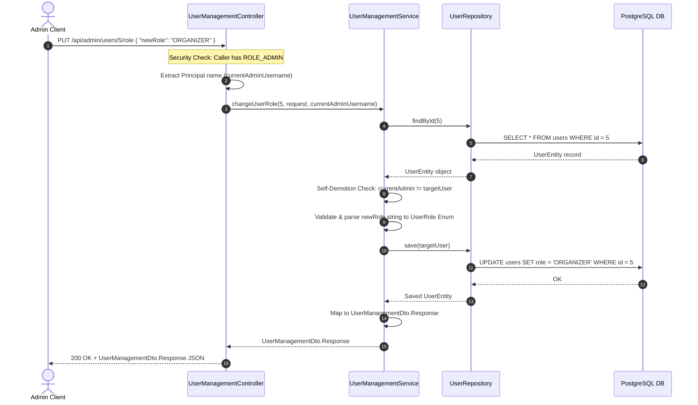
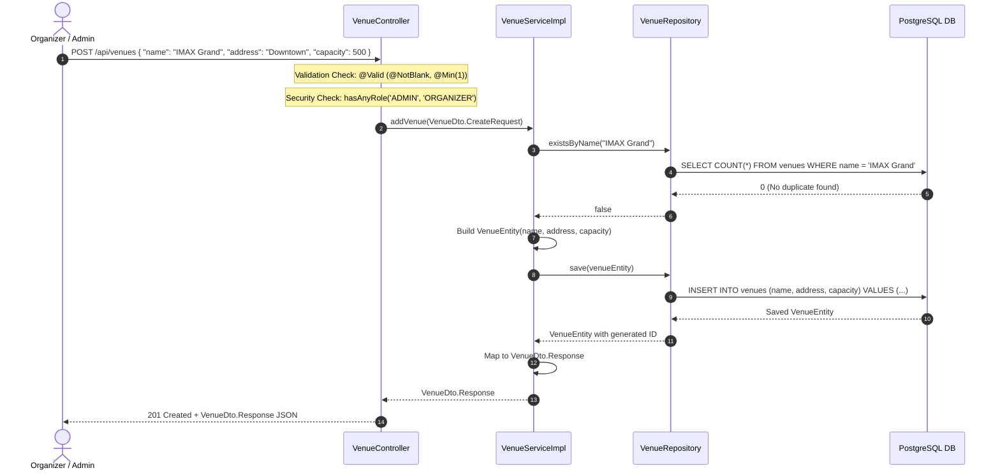

# Omar's Technical Contributions: Venue & User Management

This document serves as the authoritative technical reference and study guide for the **User Management** and **Venue Management** features in the Cinema & Event Ticketing Platform backend.

---

## 1. Architectural Overview

### 1.1 Layered Clean Architecture
The backend application strictly adheres to a **Layered Clean Architecture**, establishing a clear separation of concerns across three primary tiers:

```
[ HTTP REST Client ]
       │
       ▼
┌────────────────────────────────────────────────────────┐
│ 1. CONTROLLER LAYER (Presentation & Security Gateway) │
│    - Endpoints & Route Definitions                     │
│    - Spring Security @PreAuthorize Authorization Guards│
│    - Input Payload Validation (@Valid)                 │
└───────────────────────────┬────────────────────────────┘
                            │ (DTO Data Transfer)
                            ▼
┌────────────────────────────────────────────────────────┐
│ 2. SERVICE LAYER (Business Engine & Domain Logic)      │
│    - Transactional Boundaries (@Transactional)         │
│    - Business Rule Enforcement & Security Context Checks│
│    - Entity <-> DTO Conversions                        │
└───────────────────────────┬────────────────────────────┘
                            │ (Entities & JPQL Criteria)
                            ▼
┌────────────────────────────────────────────────────────┐
│ 3. REPOSITORY LAYER (Persistence Access Engine)        │
│    - Spring Data JPA Interfaces                        │
│    - Custom JPQL Query Methods (existsByName, etc.)    │
└───────────────────────────┬────────────────────────────┘
                            │ (SQL Queries)
                            ▼
               [( PostgreSQL Database )]
```

1. **Controller Layer (`com.hypercell.event_ticketing_platform.Controller`):** Manages incoming HTTP requests, enforces method-level security guards (`@PreAuthorize`), validates incoming payloads (`@Valid`), and maps HTTP status codes (`200 OK`, `201 Created`, `204 No Content`).
2. **Service Layer (`com.hypercell.event_ticketing_platform.Service`):** Houses core business logic, manages transactional boundaries (`@Transactional`), enforces domain invariants, performs security context inspections (e.g., self-demotion checks), and transforms entities to/from DTOs.
3. **Repository Layer (`com.hypercell.event_ticketing_platform.Repository`):** Encapsulates SQL database access using `JpaRepository` interfaces and custom derived JPQL methods.

### 1.2 Single-File Static Nested DTO Pattern
To eliminate DTO file proliferation and maintain clean package organization, every feature module uses **exactly ONE enclosing DTO file** that houses static nested classes for inputs and outputs:

```java
// Example: Single Enclosing DTO Wrapper Structure
public class UserManagementDto {

    // Response payload: Exposes safe fields, excludes sensitive data (e.g., password hashes)
    public static class Response {
        private Long id;
        private String name;
        private String email;
        private UserRole role;
    }

    // Request payload: Encapsulates input constraints using Spring Validation
    public static class Request {
        @NotBlank(message = "New role must not be blank")
        private String newRole;
    }
}
```

- **Namespaced Payload Isolation:** Request payloads (`CreateRequest`, `UpdateRequest`) and Response payloads (`Response`) are grouped under the feature's namespace (`VenueDto`, `UserManagementDto`).
- **Security & Data Integrity:** Response DTOs explicitly exclude sensitive internal attributes (like BCrypt password hashes), ensuring credentials are never leaked over HTTP.

---

## 2. Feature Analysis: User Management

### 2.1 Business Objective
The **User Management** module provides administrative governance over system accounts. It allows system administrators (`ADMIN`) to review the complete roster of registered users and dynamically update user roles across `CUSTOMER`, `ORGANIZER`, and `ADMIN`.

### 2.2 Security & Guards (`UserManagementController`)
The controller is secured at the class level using Spring Security's `@PreAuthorize` annotation:

```java
@RestController
@RequestMapping("/api/admin/users")
@PreAuthorize("hasRole('ADMIN')")
public class UserManagementController { ... }
```

- **Class-Level Guard:** Every endpoint defined within `/api/admin/users` is guarded. When an HTTP request arrives, the Spring Security AOP proxy inspects the caller's JWT `Authentication` object in `SecurityContextHolder`. If the caller lacks `ROLE_ADMIN`, Spring Security blocks execution at the filter chain level and returns `403 Forbidden`.

### 2.3 Workflow & Lifecycle: Role Modification
Tracing a request to change a user's role (`PUT /api/admin/users/{id}/role`):



### 2.4 Edge Cases & Logic (`UserManagementService`)
1. **Admin Self-Demotion Safeguard:**
   ```java
   if (currentAdminUsername != null &&
      (currentAdminUsername.equalsIgnoreCase(targetUser.getUsername()) || 
       currentAdminUsername.equalsIgnoreCase(targetUser.getEmail()))) {
       throw new IllegalArgumentException("Action Denied: Admin cannot modify their own role to prevent accidental self-demotion.");
   }
   ```
   *Rationale:* If an active administrator attempts to change their own role (e.g., demoting themselves from `ADMIN` to `CUSTOMER`), the service detects that `currentAdminUsername` matches the target user's username/email and aborts the transaction, preventing accidental lockouts.

2. **Admin Self-Deletion Safeguard & Cascade Cleanup:**
   ```java
   if (currentAdminUsername != null &&
      (currentAdminUsername.equalsIgnoreCase(targetUser.getUsername()) || 
       currentAdminUsername.equalsIgnoreCase(targetUser.getEmail()))) {
       throw new IllegalArgumentException("Action Denied: Admin cannot delete their own account.");
   }
   ```
   *Rationale:* Admins cannot accidentally delete their own logged-in system account. Before removing a user from the repository, the service performs cascade cleanup of any associated `TicketEntity` and `BookingEntity` records to prevent foreign key constraint violations in PostgreSQL.

3. **Missing User Exception Handling:**
   ```java
   UserEntity targetUser = userRepository.findById(targetUserId)
           .orElseThrow(() -> new ResourceNotFoundException("User not found with id: " + targetUserId));
   ```
   *Rationale:* If an admin supplies a non-existent user ID, the service throws `ResourceNotFoundException`, which is caught by `@RestControllerAdvice` to return a clean `404 Not Found` JSON response.

4. **Flexible & Paginated User Roster Retrieval:**
   Supports both full user list retrieval (`GET /api/admin/users`) and paginated queries (`GET /api/admin/users?page=0&size=10`), allowing administration dashboards to render efficiently across small and large user bases.

---

## 3. Feature Analysis: Venue Management

### 3.1 Business Objective
The **Venue Management** module handles cinema physical locations, addresses, and seating capacities. It provides full CRUD operations so event organizers and administrators can configure physical venues where movie screenings and events take place.

### 3.2 Method-Level Security (`VenueController`)
The controller applies differentiated authorization guards across public and administrative endpoints:

```java
@RestController
@RequestMapping("/api/venues")
public class VenueController {

    // Public Endpoint: Accessible to all users (Customers, Visitors)
    @GetMapping
    public ResponseEntity<List<VenueDto.Response>> getAllVenues() { ... }

    // Restricted Endpoint: Accessible only by ADMIN or ORGANIZER
    @PostMapping
    @PreAuthorize("hasAnyRole('ADMIN', 'ORGANIZER')")
    public ResponseEntity<VenueDto.Response> createVenue(@Valid @RequestBody VenueDto.CreateRequest venueDto) { ... }

    // Restricted Endpoint: Accessible only by ADMIN
    @DeleteMapping("/{id}")
    @PreAuthorize("hasRole('ADMIN')")
    public ResponseEntity<Void> deleteVenue(@PathVariable Long id) { ... }
}
```

- **Read Operations (`GET`):** Unprotected so clients and frontend components can freely display available cinema venues.
- **Creation & Modification (`POST`, `PUT`):** Guarded by `@PreAuthorize("hasAnyRole('ADMIN', 'ORGANIZER')")` to ensure standard customers cannot create or alter venues.
- **Deletion (`DELETE`):** Guarded by `@PreAuthorize("hasRole('ADMIN')")` to restrict catalog purging to administrators.

### 3.3 Workflow & Lifecycle: Venue Creation
Tracing a venue creation request (`POST /api/venues`):



### 3.4 Data Integrity & Custom Repository Logic (`VenueService`)
To prevent database corruption and catalog clutter:

1. **Duplicate Venue Creation Prevention:**
   ```java
   if (venueRepository.existsByName(venueDto.getName())) {
       throw new ResourceAlreadyExistsException("Venue with name '" + venueDto.getName() + "' already exists");
   }
   ```
   Before saving a new venue, `VenueServiceImpl` queries `venueRepository.existsByName(...)`. If a cinema location with the exact same name exists, execution throws `ResourceAlreadyExistsException` (`400 Bad Request` / `409 Conflict`).

2. **Duplicate Venue Update Prevention:**
   ```java
   if (venueDto.getName() != null && venueRepository.existsByNameAndIdNot(venueDto.getName(), id)) {
       throw new ResourceAlreadyExistsException("Venue with name '" + venueDto.getName() + "' already exists");
   }
   ```
   When updating an existing venue #2, `existsByNameAndIdNot("IMAX Grand", 2)` checks if *another* venue (ID != 2) uses that name. This allows venue #2 to update its address/capacity without triggering a false duplicate error on its own name.

---

## 4. Conclusion: The Data Journey

```
+-----------------------------------------------------------------------------------+
|                            THE COMPLETE DATA JOURNEY                              |
+-----------------------------------------------------------------------------------+

 1. HTTP Request (Client)
    │ Body: JSON Payload | Header: Authorization: Bearer <JWT>
    ▼
 2. Spring Security Filter Chain
    │ Validates JWT signature, authenticates user, extracts GrantedAuthorities
    ▼
 3. Spring MVC Routing & @Valid Payload Validation
    │ Enforces @NotBlank, @Min, @Size constraints before entering controller
    ▼
 4. Controller Layer Security Proxy (@PreAuthorize)
    │ Evaluates hasRole('ADMIN') or hasAnyRole('ADMIN', 'ORGANIZER')
    ▼
 5. Business Service Tier & Transaction Boundary (@Transactional)
    │ Executes business rules, self-demotion guards, duplicate name checks
    ▼
 6. Persistence Layer & Database Execution (Spring Data JPA -> PostgreSQL)
    │ Executes SELECT / INSERT / UPDATE queries via JDBC driver
    ▼
 7. DTO Serialization & Response Dispatch
    │ Maps Entity -> Safe Response DTO (excluding passwords) -> HTTP 200/201 JSON
+-----------------------------------------------------------------------------------+
```

By combining **Layered Clean Architecture**, **Single-File Static Nested DTOs**, **Spring Security `@PreAuthorize` Guards**, and **Defensive Service Validation**, both User Management and Venue Management operate as secure, robust, production-ready backend modules.
