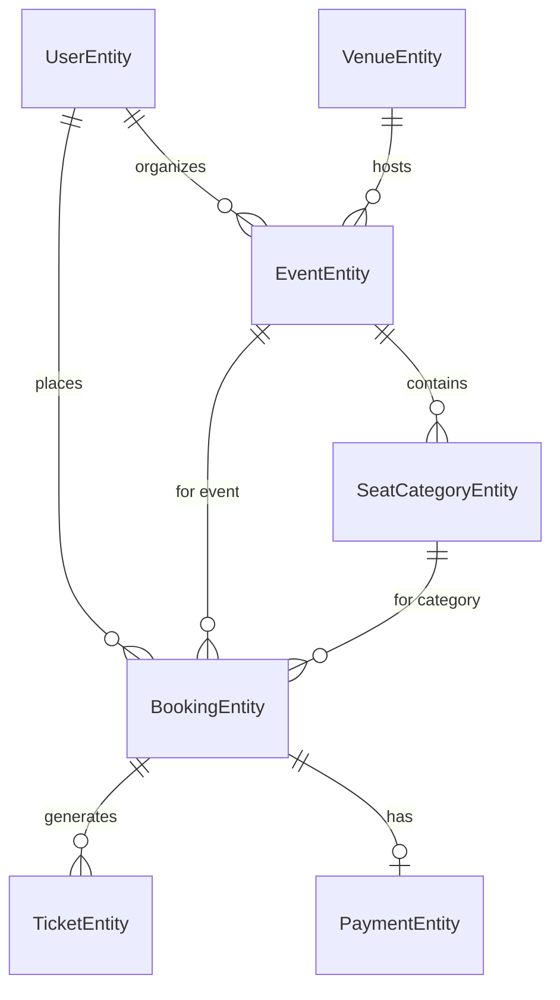

# 🎓 Capstone Defense Prep — Phase 1: The Domain & Database Layer

**Project Name:** Event Ticketing Platform  
**Target Audience:** Capstone Defense Panel & Technical Evaluators  
**Author:** Senior Java/Spring Boot Architect  

---

## 🏛️ 1. Domain Entities & Database Relationships

Your application models an **Event Ticketing System** designed around 6 core domain entities (plus `Payment`). Here is how the database entities map to physical concepts and connect to one another:



### Entity Deep-Dive:

1. **[UserEntity.java](file:///Users/macbookpro/Documents/DATA/Hypercell%20Intern/FINAL%20PROJECT/Backend/FinalProject_Backend_Hypercell/event-ticketing-platform/src/main/java/com/hypercell/event_ticketing_platform/Entity/UserEntity.java)**
   - **Role:** Represents any system actor (`CUSTOMER`, `ORGANIZER`, or `ADMIN`).
   - **Key Fields:** `id`, `username`, `email`, `password` (BCrypt hashed), `role` (`@Enumerated(EnumType.STRING)`).

2. **[VenueEntity.java](file:///Users/macbookpro/Documents/DATA/Hypercell%20Intern/FINAL%20PROJECT/Backend/FinalProject_Backend_Hypercell/event-ticketing-platform/src/main/java/com/hypercell/event_ticketing_platform/Entity/VenueEntity.java)**
   - **Role:** Represents the physical location hosting an event.
   - **Key Fields:** `id`, `name`, `address`, `capacity`.

3. **[EventEntity.java](file:///Users/macbookpro/Documents/DATA/Hypercell%20Intern/FINAL%20PROJECT/Backend/FinalProject_Backend_Hypercell/event-ticketing-platform/src/main/java/com/hypercell/event_ticketing_platform/Entity/EventEntity.java)**
   - **Role:** Central catalog entry for a concert, movie, or conference.
   - **Key Fields:** `id`, `title`, `description`, `category`, `startDate`, `endDate`, `location`, `imageUrl` (`@Column(columnDefinition = "TEXT")` to support full image URLs/uploads), `status` (`DRAFT`, `PUBLISHED`, `CANCELLED`).
   - **Relationships:**
     - `@ManyToOne organizer` $\rightarrow$ Many events are managed by **one Organizer User**.
     - `@ManyToOne venue` $\rightarrow$ Many events can be hosted at **one Venue**.
     - `@OneToMany seatCategories` $\rightarrow$ One event owns multiple seat categories (`VIP`, `Standard`, etc.) with `cascade = CascadeType.ALL` and `orphanRemoval = true`.

4. **[SeatCategoryEntity.java](file:///Users/macbookpro/Documents/DATA/Hypercell%20Intern/FINAL%20PROJECT/Backend/FinalProject_Backend_Hypercell/event-ticketing-platform/src/main/java/com/hypercell/event_ticketing_platform/Entity/SeatCategoryEntity.java)**
   - **Role:** Manages pricing tier and real-time inventory for a specific seat class.
   - **Relationships:** `@ManyToOne event` $\rightarrow$ Belongs to a parent `EventEntity`.
   - **Key Fields:** `name` (`VIP`, `STANDARD`, `PREMIUM`), `price`, `totalSeats`, `availableSeats`.
   - **Unique Constraint:** `@Table(uniqueConstraints = @UniqueConstraint(columnNames = {"event_id", "name"}))` prevents duplicate tier names for the same event.

5. **[BookingEntity.java](file:///Users/macbookpro/Documents/DATA/Hypercell%20Intern/FINAL%20PROJECT/Backend/FinalProject_Backend_Hypercell/event-ticketing-platform/src/main/java/com/hypercell/event_ticketing_platform/Entity/BookingEntity.java)**
   - **Role:** Customer transaction order encapsulating reserved seats.
   - **Relationships:**
     - `@ManyToOne user` $\rightarrow$ Customer making the reservation.
     - `@ManyToOne event` $\rightarrow$ Targeted event.
     - `@ManyToOne seatCategory` $\rightarrow$ Selected seat tier.
     - `@OneToMany tickets` $\rightarrow$ One booking generates a `List<TicketEntity>` (1 ticket per reserved seat).
   - **Key Fields:** `quantity`, `status` (`CONFIRMED`, `PENDING`, `CANCELLED`), `bookingDate`.

6. **[TicketEntity.java](file:///Users/macbookpro/Documents/DATA/Hypercell%20Intern/FINAL%20PROJECT/Backend/FinalProject_Backend_Hypercell/event-ticketing-platform/src/main/java/com/hypercell/event_ticketing_platform/Entity/TicketEntity.java)**
   - **Role:** The individual entry pass issued to a customer with QR validation support.
   - **Relationships:** `@ManyToOne booking` $\rightarrow$ Linked back to the parent reservation.
   - **Key Fields:** `ticketNumber` (e.g. `TKN-AB123-1` or `TICK-8F9A2B1C`), `ticketCode` (QR validation token `TCK-QR-...`), `isBooked` (`Boolean`).

7. **[PaymentEntity.java](file:///Users/macbookpro/Documents/DATA/Hypercell%20Intern/FINAL%20PROJECT/Backend/FinalProject_Backend_Hypercell/event-ticketing-platform/src/main/java/com/hypercell/event_ticketing_platform/Entity/PaymentEntity.java)**
   - **Role:** Financial audit record documenting successful or failed transaction details.
   - **Relationships:** `@OneToOne booking` $\rightarrow$ Unique 1-to-1 relationship with a `BookingEntity`.
   - **Key Fields:** `amount` (`BigDecimal`), `paymentMethod` (`CREDIT_CARD`, `DEBIT_CARD`, `PAYPAL`, `STRIPE`), `status` (`PENDING`, `SUCCESS`, `FAILED`, `REFUNDED`), `transactionId` (e.g. `TXN-3A8B9C1D`), `paymentDate`.

---

## ⚙️ 2. Spring Data JPA, Hibernate & PostgreSQL Interaction

💡 **Analogy for Defense Panel:**
> Think of **JPA** as the *specification/contract* (like a blueprint), **Hibernate** as the *construction engine* (translating Java actions into database language), and **Spring Data JPA** as the *automated power tools* (providing ready-to-use database queries so we don't write repetitive SQL code).

```
+-------------------------------------------------------------+
|                     Spring Boot Service Layer                |
+-------------------------------------------------------------+
                               |
                               v (Calls repository method: findById)
+-------------------------------------------------------------+
|             Spring Data JPA Repository Interfaces           |
+-------------------------------------------------------------+
                               |
                               v (Translates method call to HQL / JPQL)
+-------------------------------------------------------------+
|                    Hibernate ORM Engine                     |
+-------------------------------------------------------------+
                               |
                               v (Generates dialect-specific SQL dialect)
+-------------------------------------------------------------+
|                     PostgreSQL Database                     |
+-------------------------------------------------------------+
```

### How They Work Together in Your Platform:
1. **Spring Data JPA Interfaces** (e.g., `UserRepository`, `EventRepository`, `SeatCategoryRepository`) extend `JpaRepository<Entity, ID>`. At runtime, Spring generates proxy implementations automatically.
2. **Hibernate ORM Engine** maps Java objects to PostgreSQL tables (`@Entity`, `@Table`) and manages object states (*Transient*, *Persistent*, *Detached*).
3. **Database Transactions:** When a service method is annotated with `@Transactional`, Hibernate opens a database connection session. Any changes made to managed Java entities (e.g., `seatCategory.setAvailableSeats(...)`) are automatically detected via Hibernate **Dirty Checking** and executed as SQL `UPDATE` queries when the transaction commits.

---

## 🛡️ 3. DTOs (Data Transfer Objects) vs. Entities

💡 **Analogy for Defense Panel:**
> The **Entity** is like our internal warehouse inventory blueprint containing raw manufacturing parts and private costs. The **DTO** is the polished, customized retail package delivered to the customer — containing only what they need to see and formatted safely for shipment.

```
   [ Client / Frontend ]
          ^
          | (Exchanges JSON Payloads)
          v
   [ REST Controller ]
          ^
          | (Maps DTO <---> Entity via Service)
          v
   [ Service Layer ]
          ^
          | (Interacts with DB)
          v
   [ Database / Entity ]
```

### 4 Reasons Why We Use DTOs Instead of Exposing Raw Entities:

1. **Security & Privacy Protection:**
   - Exposing `UserEntity` directly would accidentally leak hashed passwords (`password`) and internal role structures to HTTP responses. DTOs like [AuthDtos.java](file:///Users/macbookpro/Documents/DATA/Hypercell%20Intern/FINAL%20PROJECT/Backend/FinalProject_Backend_Hypercell/event-ticketing-platform/src/main/java/com/hypercell/event_ticketing_platform/DTO/AuthDtos.java) filter out sensitive attributes.
2. **Prevention of Circular Serialization Errors:**
   - Bi-directional JPA relations (`EventEntity` $\leftrightarrow$ `SeatCategoryEntity` or `BookingEntity` $\leftrightarrow$ `TicketEntity`) cause Jackson JSON Serializer to throw `Infinite recursion (StackOverflowError)` when converting raw entities into JSON. DTOs flatten these data structures safely.
3. **API Contract Stability & Decoupling:**
   - If we rename a database column in `BookingEntity`, we don't break the Angular frontend API contract. The DTO maintains a stable contract while internal database schemas evolve.
4. **Targeted Input Validation:**
   - DTOs (e.g., `BookingDto.CreateRequest`, `EventDto.CreateRequest`) allow applying Jakarta Bean Validation constraints (`@Valid`, `@NotNull`, `@NotBlank`, `@Min`) before requests ever touch the service or database layer.

---

### Summary Checklist for Phase 1 Defense Questions:
- [x] **Entities & Relationships:** Know how `User`, `Venue`, `Event`, `SeatCategory`, `Booking`, `Ticket`, and `Payment` link together.
- [x] **JPA vs. Hibernate:** JPA = standard API specification; Hibernate = ORM implementation engine.
- [x] **Why DTOs:** Security (no raw passwords), no circular JSON loops, API stability, and clean validation.
