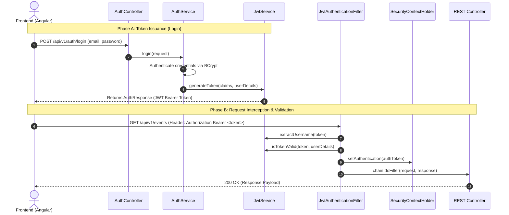

# 🎓 Capstone Defense Prep — Phase 2: Security & Authentication

**Project Name:** Event Ticketing Platform  
**Target Audience:** Capstone Defense Panel & Technical Evaluators  
**Author:** Senior Java/Spring Boot Architect  

---

## 🔒 1. Spring Security Architecture & Configuration

Your Spring Boot backend uses **Spring Security 6** configured for **Stateless JWT Authentication**. Unlike legacy monolithic applications that store session IDs in server memory, stateless security allows horizontal scaling — every HTTP request carries its own proof of authentication via a JSON Web Token (JWT).

### Key Security Components:

1. **[SecurityConfig.java](file:///Users/macbookpro/Documents/DATA/Hypercell%20Intern/FINAL%20PROJECT/Backend/FinalProject_Backend_Hypercell/event-ticketing-platform/src/main/java/com/hypercell/event_ticketing_platform/Security/SecurityConfig.java)**
   - Annotations: `@Configuration`, `@EnableWebSecurity`, `@EnableMethodSecurity`.
   - **Disables CSRF:** `csrf(AbstractHttpConfigurer::disable)` because JWT is stored in HTTP headers (not vulnerable to standard session cookie CSRF attacks).
   - **Enforces Stateless Sessions:** `sessionCreationPolicy(SessionCreationPolicy.STATELESS)`. Spring Security will never create an `HttpSession`.
   - **Defines Endpoint Authorization (`WHITE_LIST_URLS`):**
     - `/api/v1/auth/**` (Registration & Login)
     - `/api/public/events/**` (Public event catalog & search with pagination)
     - `/v3/api-docs/**`, `/v3/api-docs.yaml`, `/swagger-ui/**`, `/swagger-ui.html` (OpenAPI Swagger Documentation)
     - `/uploads/**` (Static event poster image access)
     - All other API endpoints require `.anyRequest().authenticated()`.

2. **[ApplicationConfig.java](file:///Users/macbookpro/Documents/DATA/Hypercell%20Intern/FINAL%20PROJECT/Backend/FinalProject_Backend_Hypercell/event-ticketing-platform/src/main/java/com/hypercell/event_ticketing_platform/Security/ApplicationConfig.java)**
   - Configures core security infrastructure: `AuthenticationManager`, `AuthenticationProvider` (`DaoAuthenticationProvider`), `UserDetailsService` (looking up users by email in `UserRepository`), and `BCryptPasswordEncoder`.

3. **[JwtAuthenticationEntryPoint.java](file:///Users/macbookpro/Documents/DATA/Hypercell%20Intern/FINAL%20PROJECT/Backend/FinalProject_Backend_Hypercell/event-ticketing-platform/src/main/java/com/hypercell/event_ticketing_platform/Security/JwtAuthenticationEntryPoint.java)**
   - Implements `AuthenticationEntryPoint` to catch unauthenticated requests attempting to access guarded endpoints, returning a uniform HTTP 401 Unauthorized JSON payload instead of default HTML error pages.

4. **[CorsConfig.java](file:///Users/macbookpro/Documents/DATA/Hypercell%20Intern/FINAL%20PROJECT/Backend/FinalProject_Backend_Hypercell/event-ticketing-platform/src/main/java/com/hypercell/event_ticketing_platform/Config/CorsConfig.java) & [WebConfig.java](file:///Users/macbookpro/Documents/DATA/Hypercell%20Intern/FINAL%20PROJECT/Backend/FinalProject_Backend_Hypercell/event-ticketing-platform/src/main/java/com/hypercell/event_ticketing_platform/Config/WebConfig.java)**
   - Enables Cross-Origin Resource Sharing (CORS) headers to allow the Angular frontend client (`http://localhost:4200`) to send authorization headers and credentials safely.

---

## 🔑 2. The JWT (JSON Web Token) Lifecycle

💡 **Analogy for Defense Panel:**
> A JWT is like a **digital VIP Wristband** issued by an event venue at the front gate. Once verified against your credentials, the wristband contains your encrypted identity (`userId`, `role`) and expiration date. You show this wristband to every security guard at every door (filter chain) without returning to the front desk.



### Breakdown of the 3 Stages:

### Stage A: Token Issuance (Registration & Login)
1. User sends email & password to `/api/v1/auth/login` or `/api/v1/auth/register`.
2. `AuthService.java` verifies credentials using `AuthenticationManager` and `PasswordEncoder.matches()`.
3. `JwtService.java` constructs a signed JWT token containing custom claims (`id`, `userId`, `role`) and subject (`email`), signed using HMAC-SHA256 with a secret key.

### Stage B: Filter Interception ([JwtAuthenticationFilter.java](file:///Users/macbookpro/Documents/DATA/Hypercell%20Intern/FINAL%20PROJECT/Backend/FinalProject_Backend_Hypercell/event-ticketing-platform/src/main/java/com/hypercell/event_ticketing_platform/Security/JwtAuthenticationFilter.java))
1. Extends `OncePerRequestFilter` to guarantee single execution per HTTP request.
2. Reads the HTTP header: `Authorization: Bearer <JWT_STRING>`.
3. If header is missing or doesn't start with `"Bearer "`, execution continues down the filter chain (unauthenticated).

### Stage C: Token Validation & SecurityContext Injection
1. `JwtService` extracts the user email from the token payload.
2. Checks if token signature is valid and timestamp has not expired.
3. Loads user details via `UserDetailsService`.
4. Creates a `UsernamePasswordAuthenticationToken` and injects it into `SecurityContextHolder.getContext().setAuthentication(authToken)`.
5. Spring Security now recognizes the user as logged in with their assigned authorities (`ROLE_CUSTOMER`, `ROLE_ORGANIZER`, `ROLE_ADMIN`).

---

## 🛡️ 3. Role-Based Access Control (RBAC)

Role-Based Access Control is enforced at two distinct levels: **Controller Level Annotations** and **Service Level Ownership Logic**.

### A. Controller Level Enforcement:
Using `@EnableMethodSecurity` in [SecurityConfig.java](file:///Users/macbookpro/Documents/DATA/Hypercell%20Intern/FINAL%20PROJECT/Backend/FinalProject_Backend_Hypercell/event-ticketing-platform/src/main/java/com/hypercell/event_ticketing_platform/Security/SecurityConfig.java), endpoints are guarded with Spring Expression Language (SpEL):

- **Admin Only Endpoints:**
  ```java
  @RestController
  @RequestMapping("/api/admin/users")
  @PreAuthorize("hasRole('ADMIN')")
  public class UserManagementController { ... }
  ```
- **Organizer & Admin Management Endpoints:**
  ```java
  @PostMapping
  @PreAuthorize("hasAnyRole('ORGANIZER', 'ADMIN')")
  public ResponseEntity<EventDto.Response> createEvent(...) { ... }
  ```

### B. Service Level Ownership Verification:
Even if a user has the `ORGANIZER` role, they should **not** be allowed to edit or delete an event owned by a *different* organizer.

In [EventManagementServiceImpl.java](file:///Users/macbookpro/Documents/DATA/Hypercell%20Intern/FINAL%20PROJECT/Backend/FinalProject_Backend_Hypercell/event-ticketing-platform/src/main/java/com/hypercell/event_ticketing_platform/Service/EventManagementServiceImpl.java#L240-L244):
```java
private void verifyOwnership(EventEntity event, UserEntity currentUser) {
    if (!"ADMIN".equals(currentUser.getRole().name()) && !event.getOrganizer().getId().equals(currentUser.getId())) {
        throw new AccessDeniedException("You are not authorized to manage this event");
    }
}
```
- **Logic:** If the user is an `ADMIN`, access is immediately granted. If the user is an `ORGANIZER`, their `currentUser.getId()` **must match** `event.getOrganizer().getId()`; otherwise, an `AccessDeniedException` (HTTP 403) is thrown.

---

### Summary Checklist for Phase 2 Defense Questions:
- [x] **Stateless Security:** Why stateless? No server session storage; scales horizontally via self-contained JWT tokens.
- [x] **Filter Chain Flow:** `JwtAuthenticationFilter` intercepts HTTP headers $\rightarrow$ validates signature $\rightarrow$ populates `SecurityContextHolder`.
- [x] **RBAC & Ownership:** `@PreAuthorize` controls endpoint access; `verifyOwnership()` guarantees multi-tenant event isolation between organizers.
