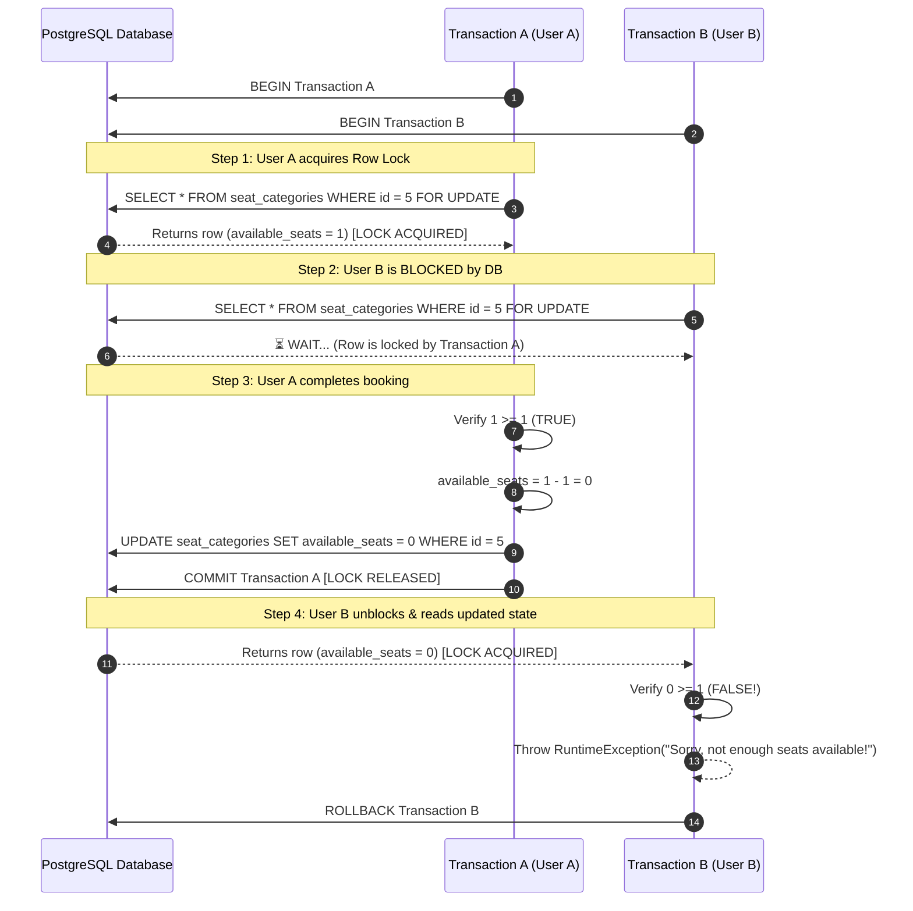

# 🎓 Capstone Defense Prep — Phase 3: Core Business Logic & Concurrency

**Project Name:** Event Ticketing Platform  
**Target Audience:** Capstone Defense Panel & Technical Evaluators  
**Author:** Senior Java/Spring Boot Architect  

---

## 💼 1. Service Layer Architecture Overview

The Service layer encapsulates domain logic, coordinates repository queries, manages transaction boundaries, and transforms entities into DTOs.

### Primary Services in Your Platform:

1. **[BookingService.java](file:///Users/macbookpro/Documents/DATA/Hypercell%20Intern/FINAL%20PROJECT/Backend/FinalProject_Backend_Hypercell/event-ticketing-platform/src/main/java/com/hypercell/event_ticketing_platform/Service/BookingService.java)**
   - Manages seat reservations, inventory deduction under pessimistic locking, unique ticket code generation, and cancellation seat restoration.
2. **[PaymentService.java](file:///Users/macbookpro/Documents/DATA/Hypercell%20Intern/FINAL%20PROJECT/Backend/FinalProject_Backend_Hypercell/event-ticketing-platform/src/main/java/com/hypercell/event_ticketing_platform/Service/PaymentService.java)**
   - Processes customer payments (`CREDIT_CARD`, `DEBIT_CARD`, `PAYPAL`, `STRIPE`), validates total cost against seat tier price $\times$ quantity, confirms bookings upon successful payment, and triggers QR ticket issuance.
3. **[EventManagementServiceImpl.java](file:///Users/macbookpro/Documents/DATA/Hypercell%20Intern/FINAL%20PROJECT/Backend/FinalProject_Backend_Hypercell/event-ticketing-platform/src/main/java/com/hypercell/event_ticketing_platform/Service/EventManagementServiceImpl.java)**
   - Manages event creation, dynamic venue resolution, pagination, ownership verification, and status state transitions (`DRAFT` $\rightarrow$ `PUBLISHED` $\rightarrow$ `CANCELLED`).
4. **[SearchPublicEvents.java](file:///Users/macbookpro/Documents/DATA/Hypercell%20Intern/FINAL%20PROJECT/Backend/FinalProject_Backend_Hypercell/event-ticketing-platform/src/main/java/com/hypercell/event_ticketing_platform/Service/SearchPublicEvents.java)**
   - Handles public event searching and backend pagination with multi-criteria filtering (category, date range, venue, keyword).
5. **[SeatCategoryServiceImpl.java](file:///Users/macbookpro/Documents/DATA/Hypercell%20Intern/FINAL%20PROJECT/Backend/FinalProject_Backend_Hypercell/event-ticketing-platform/src/main/java/com/hypercell/event_ticketing_platform/Service/SeatCategoryServiceImpl.java)**
   - Manages seat tier inventory, pricing adjustments, and capacity constraints (e.g. preventing total seat reduction below already booked counts).
6. **[TicketService.java](file:///Users/macbookpro/Documents/DATA/Hypercell%20Intern/FINAL%20PROJECT/Backend/FinalProject_Backend_Hypercell/event-ticketing-platform/src/main/java/com/hypercell/event_ticketing_platform/Service/TicketService.java)**
   - Generates unique ticket numbers (`TICK-...` / `TKN-...`) and QR validation tokens (`TCK-QR-...`) attached to confirmed bookings.
7. **[FileStorageService.java](file:///Users/macbookpro/Documents/DATA/Hypercell%20Intern/FINAL%20PROJECT/Backend/FinalProject_Backend_Hypercell/event-ticketing-platform/src/main/java/com/hypercell/event_ticketing_platform/Service/FileStorageService.java)**
   - Handles event poster image uploads to disk and returns accessible URL paths for public rendering.

---

## ⚡ 2. The Concurrency Problem: Race Conditions & Overselling

💡 **Analogy for Defense Panel:**
> Imagine a physical box office window with 1 remaining concert ticket. If two customers approach two different ticket seller windows at the exact same millisecond, both sellers look at their screen, see `1 ticket available`, and both attempt to print a ticket. Without a locking mechanism, both customers pay for the same seat — leading to a double-booking disaster.

```
       [ User A Request ]                  [ User B Request ]
               |                                   |
               v                                   v
      Read availableSeats (1)             Read availableSeats (1)
               |                                   |
    Check: 1 >= 1 (TRUE)                Check: 1 >= 1 (TRUE)
               |                                   |
    Deduct: 1 - 1 = 0                   Deduct: 1 - 1 = 0
               |                                   |
      Save SeatCategory                   Save SeatCategory
               |                                   |
               +-----------------------------------+
                                 |
              ❌ RESULT: 2 Bookings for 1 Available Seat!
```

---

## 🔒 3. The Solution: Pessimistic Locking (`PESSIMISTIC_WRITE`)

Your backend prevents overselling using **Pessimistic DB Row Locking** via Spring Data JPA and PostgreSQL.

### Implementation Code:

1. **[SeatCategoryRepository.java](file:///Users/macbookpro/Documents/DATA/Hypercell%20Intern/FINAL%20PROJECT/Backend/FinalProject_Backend_Hypercell/event-ticketing-platform/src/main/java/com/hypercell/event_ticketing_platform/Repository/SeatCategoryRepository.java#L23-L25)**
   ```java
   @Lock(LockModeType.PESSIMISTIC_WRITE)
   @Query("SELECT s FROM SeatCategoryEntity s WHERE s.id = :id")
   Optional<SeatCategoryEntity> findById(@Param("id") Long id);
   ```

2. **[BookingService.java](file:///Users/macbookpro/Documents/DATA/Hypercell%20Intern/FINAL%20PROJECT/Backend/FinalProject_Backend_Hypercell/event-ticketing-platform/src/main/java/com/hypercell/event_ticketing_platform/Service/BookingService.java#L40-L61)**
   ```java
   @Transactional
   public BookingDto.Response createBooking(BookingDto.CreateRequest request) {
       // 1. Aquires PESSIMISTIC_WRITE lock on seat_categories row
       SeatCategoryEntity seatCategory = seatCategoryRepository.findById(request.getSeatCategoryId())
               .orElseThrow(() -> new RuntimeException("Seat category not found"));

       // 2. Safely check available seats
       if (seatCategory.getAvailableSeats() < request.getQuantity()) {
           throw new RuntimeException("Sorry, not enough seats available!");
       }

       // 3. Deduct available capacity safely
       seatCategory.setAvailableSeats(seatCategory.getAvailableSeats() - request.getQuantity());
       seatCategoryRepository.save(seatCategory);
       ...
   }
   ```

---

## 🔁 4. Step-by-Step Concurrent Execution Sequence

Here is the exact step-by-step SQL sequence executed inside PostgreSQL when **User A** and **User B** try to book the last seat (`available_seats = 1`) simultaneously:



### Why Pessimistic Locking over Optimistic Locking?
- **Optimistic Locking (`@Version`):** Checks version numbers upon commit. Under high ticket flash-sales, multiple users collide, causing high numbers of `OptimisticLockException` retries and bad user experience.
- **Pessimistic Locking (`FOR UPDATE`):** Locks the row upfront at read time. Guarantees FIFO queuing at the database level, ensuring zero overselling and immediate rejection when capacity reaches 0.

---

### Summary Checklist for Phase 3 Defense Questions:
- [x] **Race Conditions:** Understand what happens when 2 threads modify inventory without locking.
- [x] **Pessimistic Locking Mechanism:** `@Lock(LockModeType.PESSIMISTIC_WRITE)` executes SQL `SELECT ... FOR UPDATE`.
- [x] **Transaction Atomicity:** `@Transactional` guarantees that if ticket generation or DB save fails, all seat deductions are automatically rolled back.
